# RAG Financial AI - Visual Architecture Guide

> **Purpose**: Comprehensive visual documentation of system architecture using Mermaid diagrams
> **Audience**: Learning and reference
> **Last Updated**: 2025-11-14

---

## Table of Contents
1. [System Architecture Overview](#system-architecture-overview)
2. [RAG Pipeline Deep Dive](#rag-pipeline-deep-dive)
3. [API Request Flow](#api-request-flow)
4. [Document Processing Pipeline](#document-processing-pipeline)
5. [Database Schema](#database-schema)
6. [Docker Container Architecture](#docker-container-architecture)
7. [CI/CD Pipeline](#cicd-pipeline)
8. [Component Dependencies](#component-dependencies)
9. [Authentication Flow](#authentication-flow)
10. [Error Handling Flow](#error-handling-flow)

---

## System Architecture Overview

### High-Level Architecture

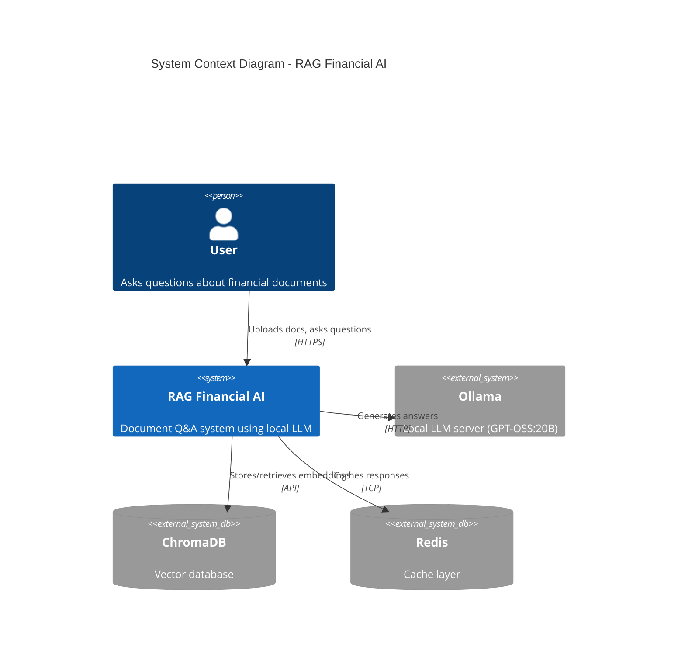

### Detailed Component Architecture

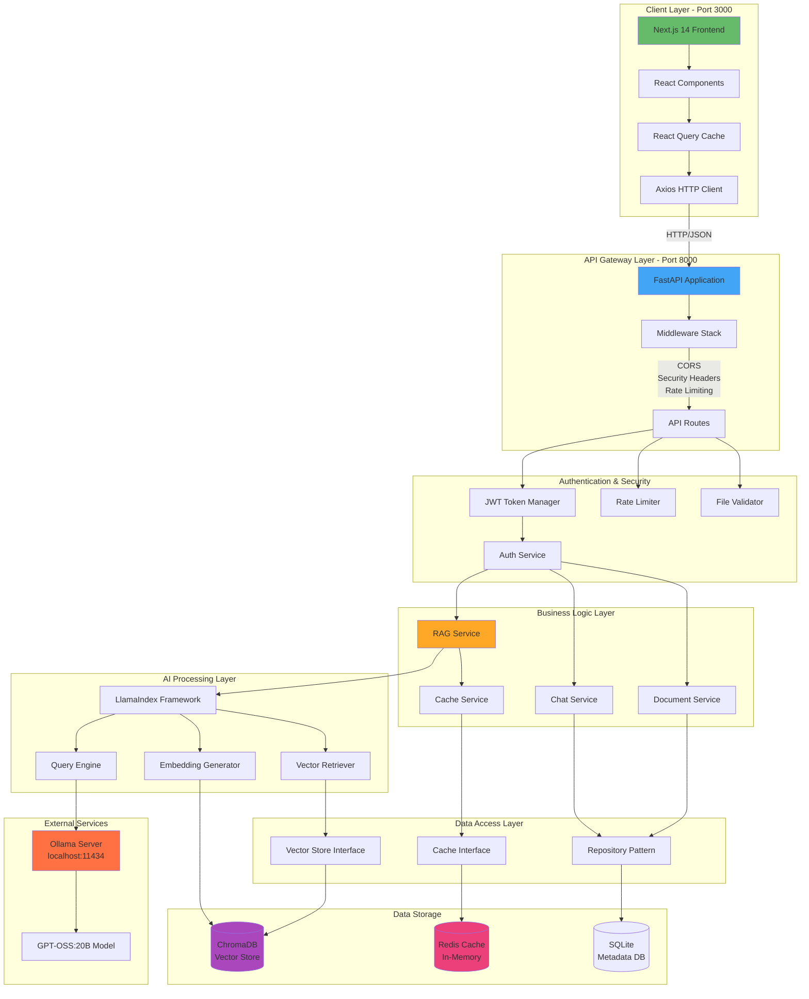

---

## RAG Pipeline Deep Dive

### Complete RAG Flow (5 Stages)

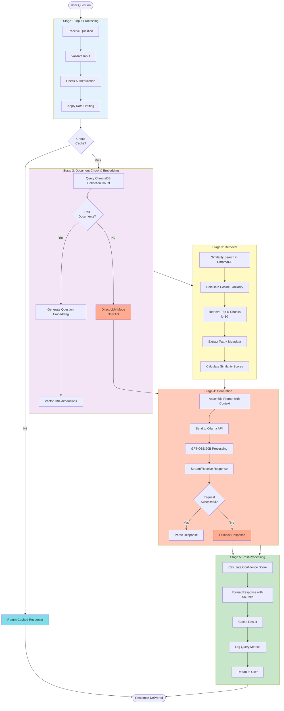

### Embedding Generation Process

```mermaid
graph TB
    subgraph "Text to Vector Conversion"
        T1["Input Text:<br/>'The company revenue was $2.5M'"]
        T2[Tokenization]
        T3[Token IDs:<br/>[101, 1996, 2194, ...]]
        T4[HuggingFace Model<br/>all-MiniLM-L6-v2]
        T5[Mean Pooling]
        T6["Embedding Vector:<br/>[0.234, -0.456, 0.678, ...]<br/>384 dimensions"]
        T7[L2 Normalization]
        T8["Normalized Vector:<br/>Ready for similarity search"]

        T1 --> T2 --> T3 --> T4 --> T5 --> T6 --> T7 --> T8
    end

    subgraph "Vector Properties"
        P1["Length: Fixed 384 dimensions"]
        P2["Range: -1 to +1 per dimension"]
        P3["Normalized: Unit length"]
        P4["Semantic: Similar meaning = close vectors"]
    end

    style T1 fill:#e1f5ff
    style T8 fill:#c8e6c9
    style T4 fill:#fff3e0
```

### Similarity Search Mechanism

```mermaid
graph LR
    subgraph "Query Vector"
        Q["Question Embedding<br/>[0.23, -0.45, 0.67, ...]"]
    end

    subgraph "Document Vectors in ChromaDB"
        D1["Doc Chunk 1<br/>[0.25, -0.43, 0.69, ...]<br/>Score: 0.92"]
        D2["Doc Chunk 2<br/>[0.10, -0.20, 0.30, ...]<br/>Score: 0.65"]
        D3["Doc Chunk 3<br/>[0.80, 0.50, -0.20, ...]<br/>Score: 0.12"]
        DN["... 100 more chunks"]
    end

    subgraph "Retrieval Process"
        CALC[Cosine Similarity<br/>cos(θ) = A·B / ||A|| ||B||]
        SORT[Sort by Score DESC]
        TOPK[Select Top-10]
    end

    subgraph "Results"
        R["Top-10 Most Similar Chunks<br/>with metadata"]
    end

    Q --> CALC
    D1 --> CALC
    D2 --> CALC
    D3 --> CALC
    DN --> CALC

    CALC --> SORT --> TOPK --> R

    style D1 fill:#4caf50,color:#fff
    style D2 fill:#8bc34a
    style D3 fill:#ffeb3b
    style R fill:#2196f3,color:#fff
```

---

## API Request Flow

### Chat Query Request Sequence

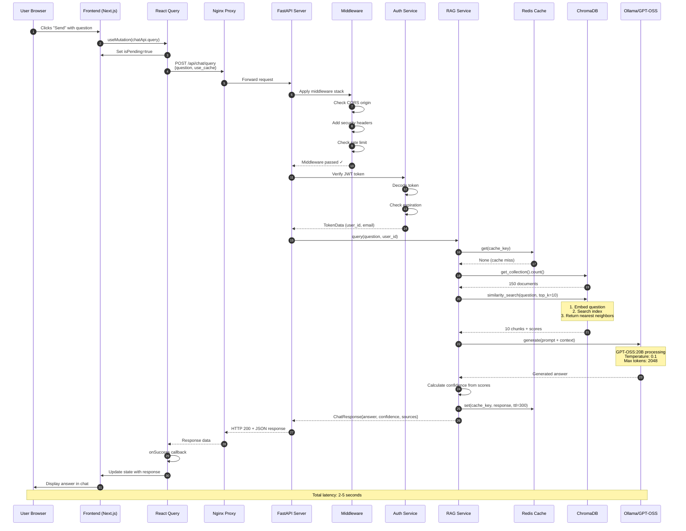

### Document Upload Flow

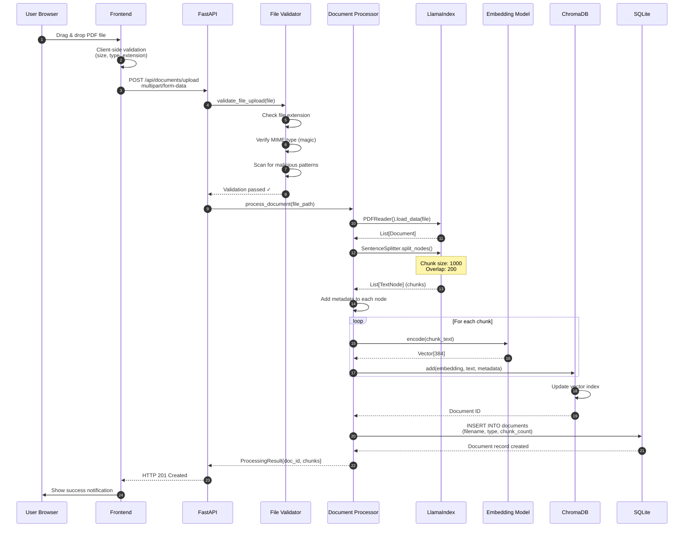

---

## Document Processing Pipeline

### Multi-Format Document Processing

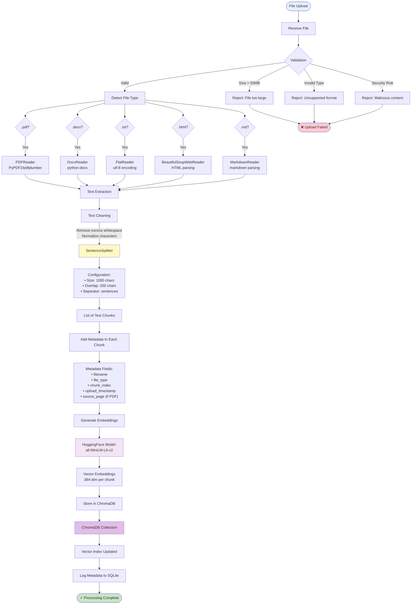

### Chunking Strategy Visualization

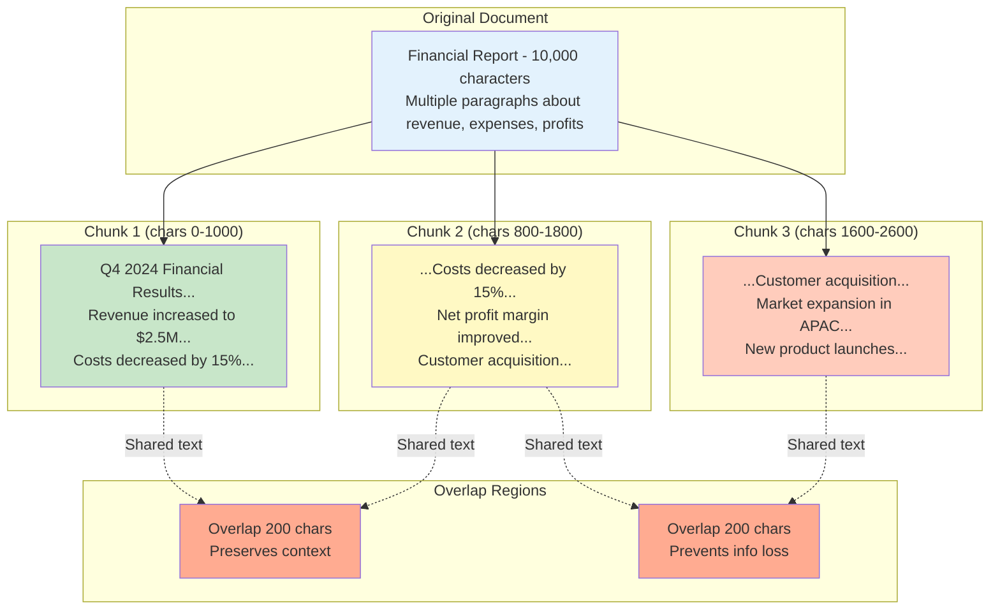

---

## Database Schema

### ChromaDB Collection Structure

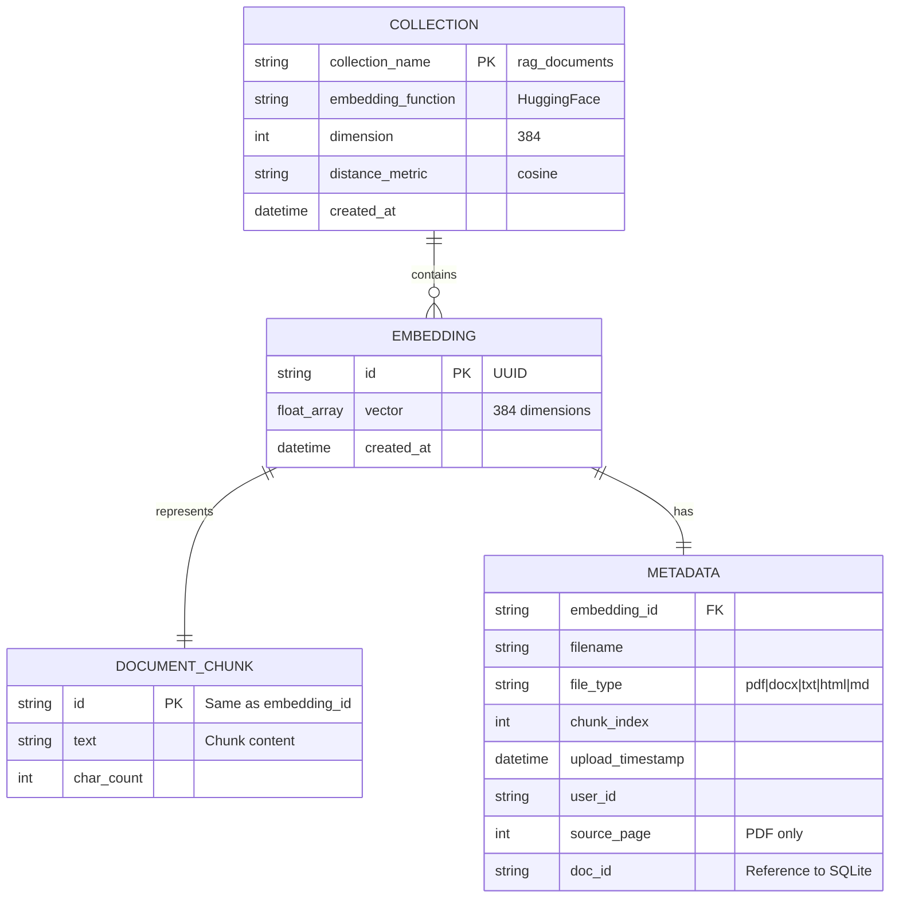

### SQLite Metadata Schema

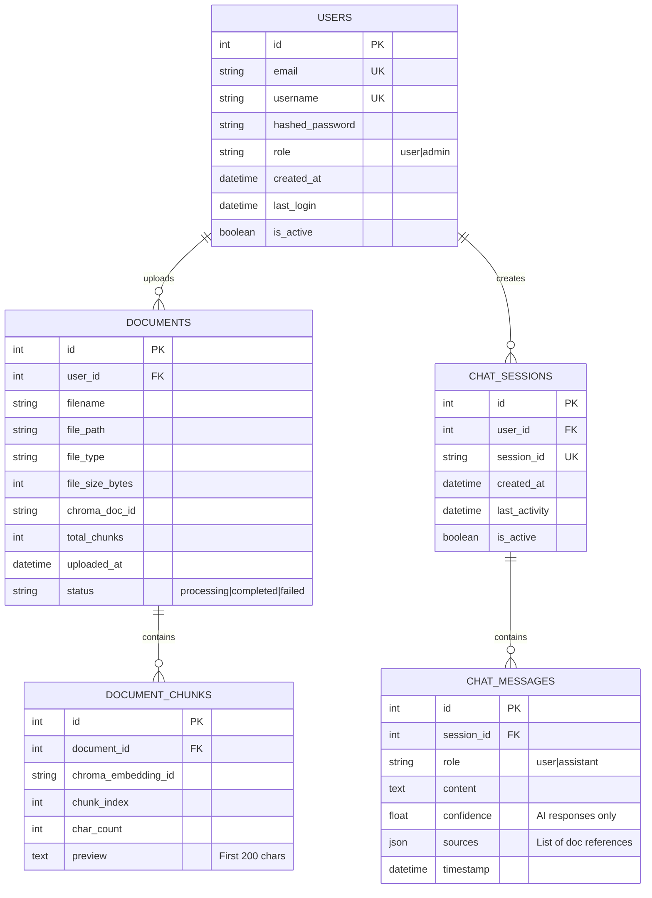

### Redis Cache Structure

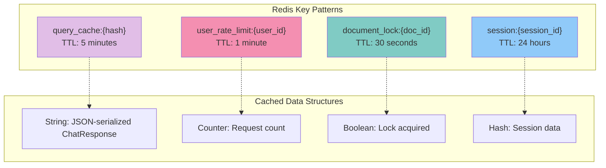

---

## Docker Container Architecture

### Container Orchestration

```mermaid
graph TB
    subgraph "Docker Compose Network"
        subgraph "Frontend Container"
            NEXT[Next.js Server<br/>Port 3000]
            NEXT_BUILD[Production Build<br/>Optimized Assets]
            NEXT --> NEXT_BUILD
        end

        subgraph "Backend Container"
            FASTAPI_MAIN[FastAPI Application<br/>Port 8000]
            UVICORN[Uvicorn ASGI Server<br/>4 workers]
            FASTAPI_MAIN --> UVICORN
        end

        subgraph "Nginx Container"
            NGINX[Nginx Reverse Proxy<br/>Port 80/443]
            NGINX_CONF[nginx.conf<br/>Routing Rules]
            SSL[SSL Certificates<br/>Let's Encrypt]
            NGINX --> NGINX_CONF
            NGINX --> SSL
        end

        subgraph "Redis Container"
            REDIS_SRV[Redis Server<br/>Port 6379]
            REDIS_VOL[/data Volume<br/>Persistent Cache]
            REDIS_SRV --> REDIS_VOL
        end

        subgraph "ChromaDB Container"
            CHROMA_SRV[ChromaDB Server<br/>Port 8001]
            CHROMA_VOL[/chroma/data Volume<br/>Vector Store]
            CHROMA_SRV --> CHROMA_VOL
        end

        subgraph "Celery Worker Container"
            CELERY[Celery Worker]
            CELERY_TASKS[Background Tasks<br/>Document Processing]
            CELERY --> CELERY_TASKS
        end
    end

    subgraph "External Dependencies"
        OLLAMA_EXT[Ollama Server<br/>host.docker.internal:11434]
    end

    subgraph "Persistent Volumes"
        VOL1[vector-store/<br/>ChromaDB data]
        VOL2[uploads/<br/>Document storage]
        VOL3[logs/<br/>Application logs]
    end

    NGINX -->|/:3000| NEXT
    NGINX -->|/api:8000| UVICORN

    FASTAPI_MAIN --> REDIS_SRV
    FASTAPI_MAIN --> CHROMA_SRV
    FASTAPI_MAIN --> OLLAMA_EXT

    CELERY --> REDIS_SRV
    CELERY --> CHROMA_SRV

    CHROMA_SRV --> VOL1
    FASTAPI_MAIN --> VOL2
    FASTAPI_MAIN --> VOL3

    style NGINX fill:#4caf50
    style FASTAPI_MAIN fill:#2196f3
    style NEXT fill:#00bcd4
    style REDIS_SRV fill:#f44336
    style CHROMA_SRV fill:#9c27b0
    style OLLAMA_EXT fill:#ff9800
```

### Docker Build Process

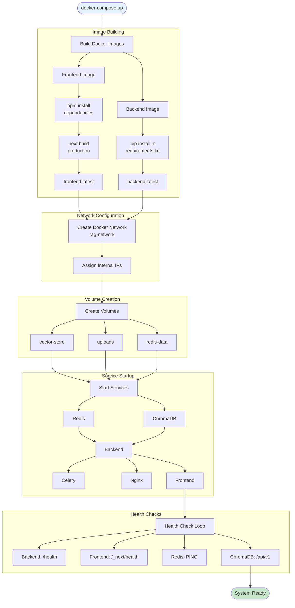

---

## CI/CD Pipeline

### GitHub Actions Workflow

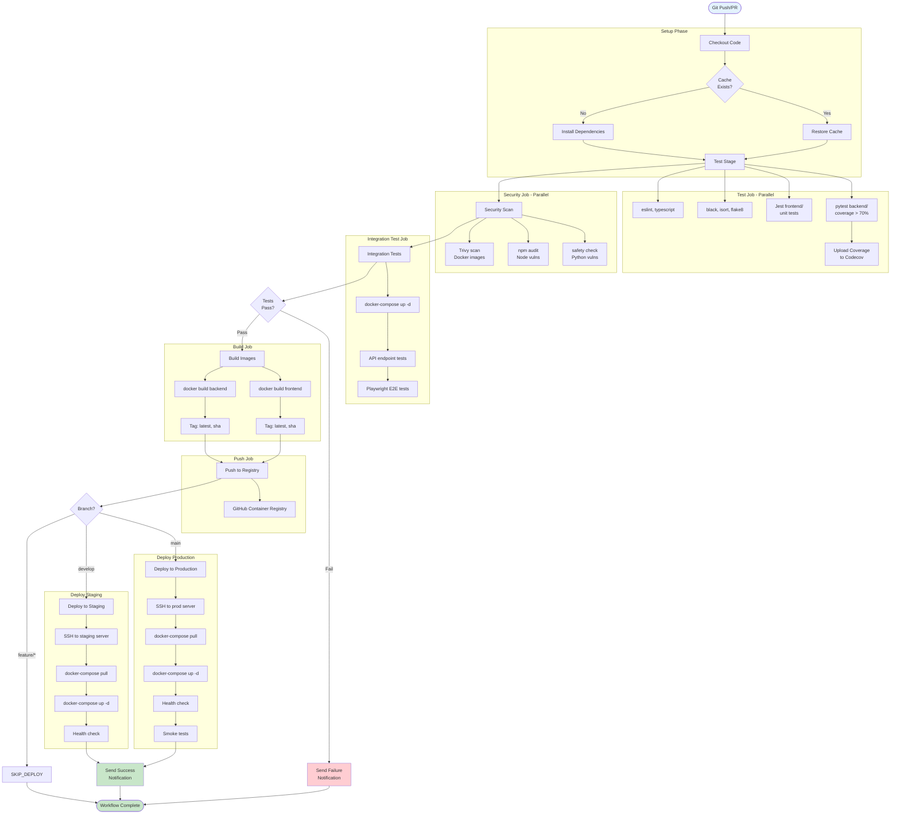

---

## Component Dependencies

### Backend Dependency Graph

```mermaid
graph TB
    subgraph "Entry Point"
        MAIN[main.py<br/>FastAPI App]
    end

    subgraph "API Layer"
        ROUTES_CHAT[routes/chat.py]
        ROUTES_DOC[routes/documents.py]
        ROUTES_HEALTH[routes/health.py]
    end

    subgraph "Core Layer"
        CONFIG[core/config.py<br/>Settings]
        AUTH[core/auth.py<br/>JWT]
        SECURITY[core/security.py<br/>Validation]
        EXCEPTIONS[core/exceptions.py]
        MIDDLEWARE[core/middleware.py]
    end

    subgraph "Service Layer"
        RAG[services/rag_service.py]
        CHAT[services/chat_service.py]
        DOC[services/document_service.py]
        CACHE[services/cache_service.py]
    end

    subgraph "Utilities"
        DOC_PROC[utils/document_processor.py]
        LOGGER[utils/logger.py]
    end

    subgraph "Repository Layer"
        REPO_USER[repositories/user_repository.py]
        REPO_DOC[repositories/document_repository.py]
        REPO_CHAT[repositories/chat_repository.py]
    end

    subgraph "External Dependencies"
        LLAMAINDEX[LlamaIndex]
        PYDANTIC[Pydantic]
        SQLALCHEMY[SQLAlchemy]
        CHROMADB[ChromaDB Client]
        REDIS_CLIENT[Redis Client]
        REQUESTS[Requests/httpx]
    end

    MAIN --> ROUTES_CHAT
    MAIN --> ROUTES_DOC
    MAIN --> ROUTES_HEALTH
    MAIN --> MIDDLEWARE

    ROUTES_CHAT --> AUTH
    ROUTES_DOC --> AUTH
    ROUTES_CHAT --> RAG
    ROUTES_DOC --> DOC

    RAG --> CACHE
    RAG --> LLAMAINDEX
    RAG --> CONFIG

    DOC --> DOC_PROC
    DOC --> SECURITY
    DOC --> REPO_DOC

    CHAT --> REPO_CHAT

    DOC_PROC --> LLAMAINDEX

    CACHE --> REDIS_CLIENT

    ALL_SERVICES[All Services] --> CONFIG
    ALL_SERVICES --> LOGGER
    ALL_SERVICES --> EXCEPTIONS

    REPO_USER --> SQLALCHEMY
    REPO_DOC --> SQLALCHEMY
    REPO_CHAT --> SQLALCHEMY

    RAG --> CHROMADB
    DOC_PROC --> CHROMADB

    AUTH --> PYDANTIC
    SECURITY --> PYDANTIC

    style MAIN fill:#42a5f5,color:#fff
    style CONFIG fill:#ffa726
    style RAG fill:#66bb6a
```

### Frontend Dependency Graph

```mermaid
graph TB
    subgraph "Entry Point"
        APP[app/page.tsx<br/>Root Page]
        LAYOUT[app/layout.tsx<br/>Root Layout]
    end

    subgraph "Providers"
        QUERY_PROVIDER[lib/query-provider.tsx<br/>React Query]
        THEME_PROVIDER[components/theme-provider.tsx]
    end

    subgraph "Pages"
        CHAT_PAGE[app/chat/page.tsx]
        DOCS_PAGE[app/documents/page.tsx]
    end

    subgraph "Feature Components"
        CHAT_INTERFACE[components/chat/chat-interface.tsx]
        CHAT_MESSAGE[components/chat/chat-message.tsx]
        DOC_UPLOAD[components/documents/document-upload.tsx]
        DOC_LIST[components/documents/document-list.tsx]
    end

    subgraph "UI Components (shadcn)"
        BUTTON[components/ui/button.tsx]
        INPUT[components/ui/input.tsx]
        CARD[components/ui/card.tsx]
        TOAST[components/ui/toast.tsx]
        DIALOG[components/ui/dialog.tsx]
    end

    subgraph "API Layer"
        API_CLIENT[lib/api.ts<br/>Axios Client]
        CHAT_API[lib/api.ts:chatApi]
        DOC_API[lib/api.ts:documentsApi]
    end

    subgraph "Types"
        TYPES[types/index.ts<br/>TypeScript Definitions]
    end

    subgraph "External Dependencies"
        REACT_QUERY[@tanstack/react-query]
        AXIOS[axios]
        RADIX[Radix UI]
        TAILWIND[Tailwind CSS]
        NEXT[Next.js 14]
    end

    LAYOUT --> QUERY_PROVIDER
    LAYOUT --> THEME_PROVIDER
    APP --> CHAT_PAGE
    APP --> DOCS_PAGE

    CHAT_PAGE --> CHAT_INTERFACE
    DOCS_PAGE --> DOC_UPLOAD
    DOCS_PAGE --> DOC_LIST

    CHAT_INTERFACE --> CHAT_MESSAGE
    CHAT_INTERFACE --> BUTTON
    CHAT_INTERFACE --> INPUT
    CHAT_INTERFACE --> TOAST

    DOC_UPLOAD --> BUTTON
    DOC_UPLOAD --> CARD
    DOC_UPLOAD --> TOAST

    CHAT_INTERFACE --> CHAT_API
    DOC_UPLOAD --> DOC_API
    DOC_LIST --> DOC_API

    CHAT_API --> API_CLIENT
    DOC_API --> API_CLIENT

    API_CLIENT --> AXIOS

    ALL_COMPONENTS[All Components] --> TYPES

    QUERY_PROVIDER --> REACT_QUERY
    UI_COMPONENTS[UI Components] --> RADIX
    UI_COMPONENTS --> TAILWIND

    style APP fill:#66bb6a,color:#fff
    style API_CLIENT fill:#42a5f5,color:#fff
    style TYPES fill:#ffa726
```

---

## Authentication Flow

### JWT Authentication Process

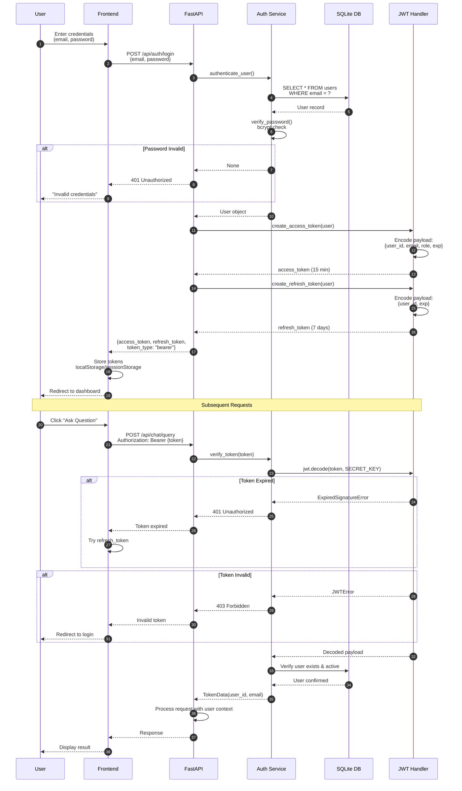

### Role-Based Access Control

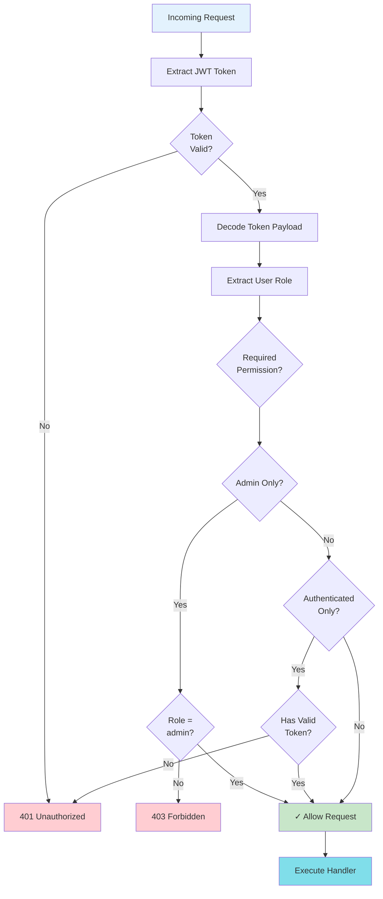

---

## Error Handling Flow

### Multi-Layer Error Handling

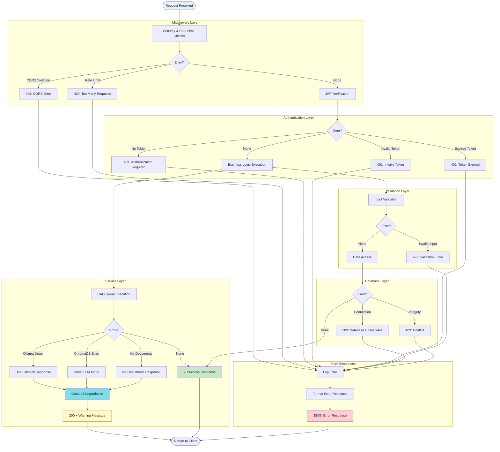

### Error Response Format

```mermaid
classDiagram
    class ErrorResponse {
        +string error_type
        +string message
        +dict details
        +int status_code
        +timestamp datetime
        +string request_id
        +toJSON()
    }

    class ValidationError {
        +list field_errors
        +getFieldDetails()
    }

    class AuthenticationError {
        +string token_type
        +string suggested_action
    }

    class ServiceError {
        +string service_name
        +bool is_retryable
        +string fallback_used
    }

    class DatabaseError {
        +string operation
        +string table
        +getSafeMessage()
    }

    ErrorResponse <|-- ValidationError
    ErrorResponse <|-- AuthenticationError
    ErrorResponse <|-- ServiceError
    ErrorResponse <|-- DatabaseError

    note for ErrorResponse "All errors follow consistent format\nfor frontend parsing"
    note for ServiceError "Includes fallback info\nfor graceful degradation"
```

---

## Performance Optimization Flow

### Caching Strategy

```mermaid
graph TB
    QUERY[User Query] --> HASH[Generate Cache Key<br/>SHA256(question + params)]

    HASH --> REDIS_CHECK{Check Redis<br/>Cache}

    REDIS_CHECK -->|Cache Hit| VALIDATE_CACHE{Cache<br/>Valid?}
    VALIDATE_CACHE -->|Yes| RETURN_CACHED[Return Cached Response<br/>~10ms]
    VALIDATE_CACHE -->|No| INVALIDATE[Invalidate Cache]

    REDIS_CHECK -->|Cache Miss| RAG_QUERY[Execute RAG Query]
    INVALIDATE --> RAG_QUERY

    RAG_QUERY --> EMBED[Generate Embedding<br/>~100ms]
    EMBED --> SEARCH[ChromaDB Search<br/>~200ms]
    SEARCH --> LLM[Ollama Generation<br/>~2000ms]

    LLM --> RESPONSE[Format Response]
    RESPONSE --> CACHE_STORE[Store in Redis<br/>TTL: 5 min]
    CACHE_STORE --> RETURN_NEW[Return New Response<br/>~2300ms]

    RETURN_CACHED --> END([Response Delivered])
    RETURN_NEW --> END

    style RETURN_CACHED fill:#4caf50,color:#fff
    style RETURN_NEW fill:#ff9800,color:#fff
    style REDIS_CHECK fill:#e1bee7
```

---

## Summary

This visual architecture guide provides comprehensive diagrams showing:

1. **System Architecture** - How all components connect
2. **RAG Pipeline** - Complete flow from document to answer
3. **API Flows** - Request/response sequences
4. **Data Models** - Database schemas and relationships
5. **Infrastructure** - Docker and deployment architecture
6. **CI/CD** - Automated testing and deployment
7. **Dependencies** - Component relationships
8. **Security** - Authentication and authorization flows
9. **Error Handling** - Multi-layer error management
10. **Performance** - Caching and optimization strategies

These diagrams serve as both **learning resources** and **reference documentation** for understanding how the RAG Financial AI system works at every level.

---

*Generated for educational purposes - 2025-11-14*
