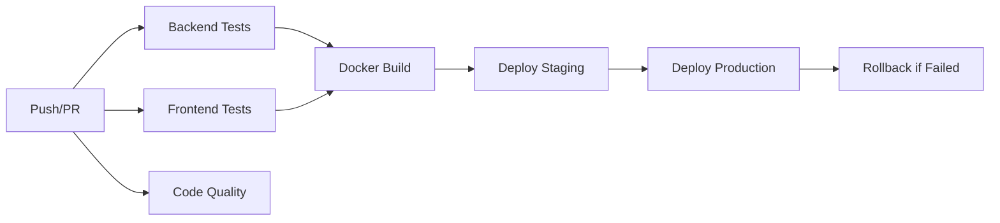

# CI/CD Pipeline Documentation

## 🚀 Overview

This project uses GitHub Actions for continuous integration and deployment. The pipeline ensures code quality, runs comprehensive tests, builds Docker images, and deploys to multiple environments.

## 📊 Pipeline Architecture



## 🔄 Workflows

### 1. Backend Tests (`backend-tests.yml`)
**Triggers**: Push to main/develop, PRs affecting backend
- ✅ Python 3.9, 3.10, 3.11 matrix testing
- ✅ Unit tests with coverage
- ✅ Integration tests
- ✅ Security scanning with Bandit
- ✅ Linting (Black, Flake8, isort)

### 2. Frontend Tests (`frontend-tests.yml`)
**Triggers**: Push to main/develop, PRs affecting frontend
- ✅ Node.js 18.x, 20.x matrix testing
- ✅ Unit tests with Jest
- ✅ E2E tests with Playwright
- ✅ Accessibility testing
- ✅ Bundle size checks
- ✅ TypeScript validation

### 3. Docker Build (`docker-build.yml`)
**Triggers**: Push to main, tags, manual
- ✅ Multi-platform builds (amd64, arm64)
- ✅ GitHub Container Registry push
- ✅ Vulnerability scanning with Trivy
- ✅ Docker Compose validation

### 4. Deployment (`deploy.yml`)
**Triggers**: Version tags, manual deployment
- ✅ Staging deployment
- ✅ Production deployment with approval
- ✅ Blue-green deployment strategy
- ✅ Automatic rollback on failure
- ✅ Smoke tests
- ✅ Slack notifications

### 5. Code Quality (`code-quality.yml`)
**Triggers**: All pushes, PRs, weekly schedule
- ✅ Python and JavaScript linting
- ✅ Security scanning with CodeQL
- ✅ Dependency vulnerability checks
- ✅ License compliance
- ✅ Code complexity analysis
- ✅ SonarCloud integration

### 6. PR Validation (`pr-validation.yml`)
**Triggers**: All PR events
- ✅ Semantic PR title validation
- ✅ PR size checks
- ✅ Sensitive data scanning
- ✅ Auto-labeling
- ✅ Auto-assign reviewers
- ✅ Dependency review

## 🔐 Required Secrets

Configure these secrets in GitHub repository settings:

### GitHub Actions
- `GITHUB_TOKEN`: Automatically provided

### AWS (for deployment)
- `AWS_ACCESS_KEY_ID`: AWS access key
- `AWS_SECRET_ACCESS_KEY`: AWS secret key

### External Services
- `SONAR_TOKEN`: SonarCloud authentication
- `SLACK_WEBHOOK`: Slack notification webhook

### Optional
- `CODECOV_TOKEN`: Codecov.io integration
- `SENTRY_DSN`: Error tracking

## 🏷️ Branch Protection Rules

### Main Branch
```yaml
- Require PR before merging
- Require status checks:
  - backend-tests
  - frontend-tests
  - code-quality
- Require up-to-date branches
- Require code owner reviews
- Dismiss stale reviews
- Restrict who can push
```

### Develop Branch
```yaml
- Require PR before merging
- Require status checks:
  - backend-tests
  - frontend-tests
- Require at least 1 review
```

## 📦 Deployment Environments

### Staging
- **URL**: `https://staging.rag-financial-ai.example.com`
- **Auto-deploy**: On push to develop
- **Approval**: Not required
- **Rollback**: Manual

### Production
- **URL**: `https://rag-financial-ai.example.com`
- **Auto-deploy**: On version tags (v*)
- **Approval**: Required
- **Rollback**: Automatic on failure

## 🛠️ Local Testing

### Run CI checks locally
```bash
# Backend
cd backend
black . --check
flake8 .
pytest tests/unit/ -v --cov=.

# Frontend
cd frontend
npm run lint
npm run type-check
npm test

# Docker
docker-compose build
docker-compose up
```

### Act (run GitHub Actions locally)
```bash
# Install act
brew install act  # macOS
# or
curl https://raw.githubusercontent.com/nektos/act/master/install.sh | sudo bash

# Run workflows
act -W .github/workflows/backend-tests.yml
act -W .github/workflows/frontend-tests.yml
```

## 📈 Monitoring & Reporting

### Coverage Reports
- **Backend**: Uploaded to Codecov, HTML artifacts
- **Frontend**: LCOV reports, coverage badges
- **Threshold**: 60% minimum coverage

### Security Reports
- **Trivy**: Container scanning results
- **CodeQL**: Code security analysis
- **Bandit**: Python security issues
- **npm audit**: JavaScript dependencies

### Performance Metrics
- **Bundle size**: Tracked per PR
- **Build time**: Monitored in workflows
- **Test execution time**: Logged

## 🚨 Troubleshooting

### Common Issues

#### Tests failing in CI but passing locally
```bash
# Ensure same Python/Node version
python --version
node --version

# Clean install dependencies
rm -rf venv node_modules
pip install -r requirements.txt
npm ci
```

#### Docker build failures
```bash
# Clear Docker cache
docker system prune -a

# Rebuild without cache
docker-compose build --no-cache
```

#### Deployment failures
```bash
# Check AWS credentials
aws sts get-caller-identity

# Verify ECS service status
aws ecs describe-services --cluster rag-production --services rag-backend
```

## 🔄 Rollback Procedures

### Automatic Rollback
Production deployments automatically rollback on:
- Health check failures
- Smoke test failures
- Performance degradation

### Manual Rollback
```bash
# Revert to previous version
git revert HEAD
git push origin main

# Or trigger previous workflow
gh workflow run deploy.yml -f environment=production -f version=v1.2.3
```

## 📝 Best Practices

1. **Commit Messages**: Use conventional commits
   ```
   feat: add new feature
   fix: resolve bug
   docs: update documentation
   test: add tests
   ```

2. **PR Size**: Keep PRs under 500 lines
3. **Test Coverage**: Maintain >60% coverage
4. **Security**: Never commit secrets
5. **Dependencies**: Update weekly via Dependabot

## 🎯 Performance Targets

- **CI Pipeline**: < 10 minutes
- **Docker Build**: < 5 minutes
- **Deployment**: < 15 minutes
- **Rollback**: < 2 minutes

## 📊 Metrics Dashboard

Access CI/CD metrics at:
- GitHub Actions: `https://github.com/<org>/rag-financial-ai/actions`
- SonarCloud: `https://sonarcloud.io/project/rag-financial-ai`
- Codecov: `https://codecov.io/gh/<org>/rag-financial-ai`

## 🔗 Related Documentation

- [Testing Guide](TESTING_SUMMARY.md)
- [Deployment Guide](docs/deployment.md)
- [Contributing Guide](CONTRIBUTING.md)
- [Architecture](docs/architecture.md)