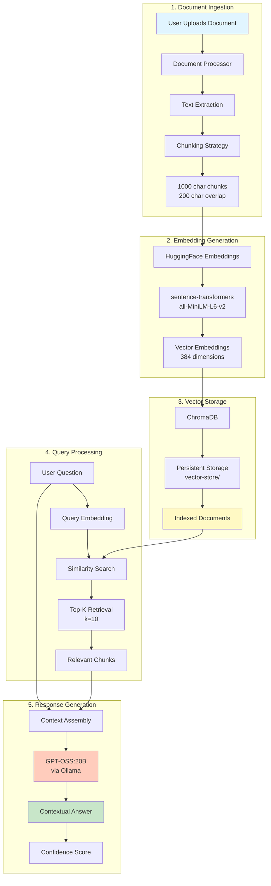
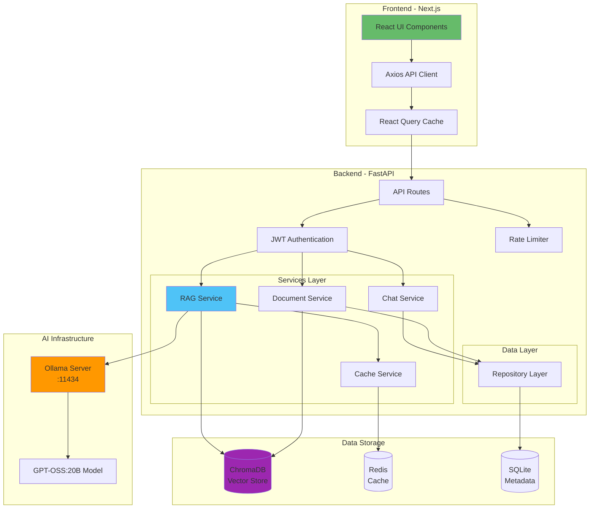
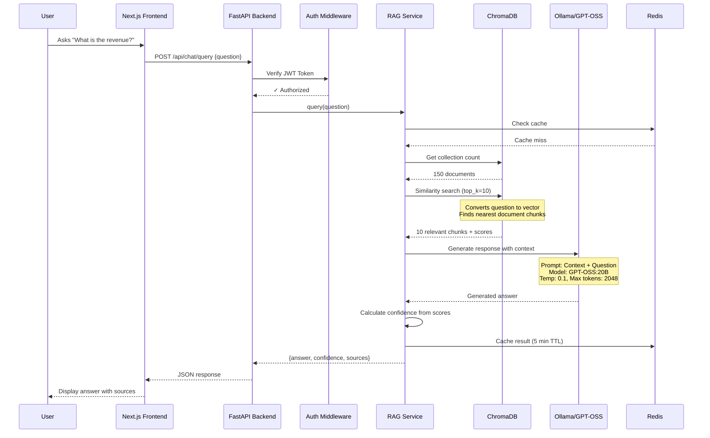
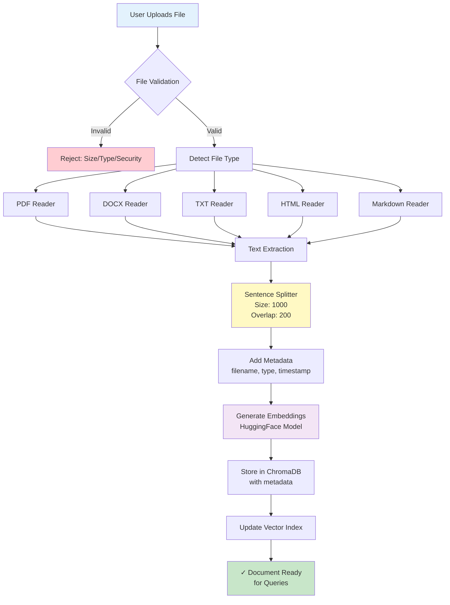
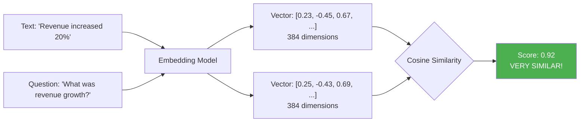
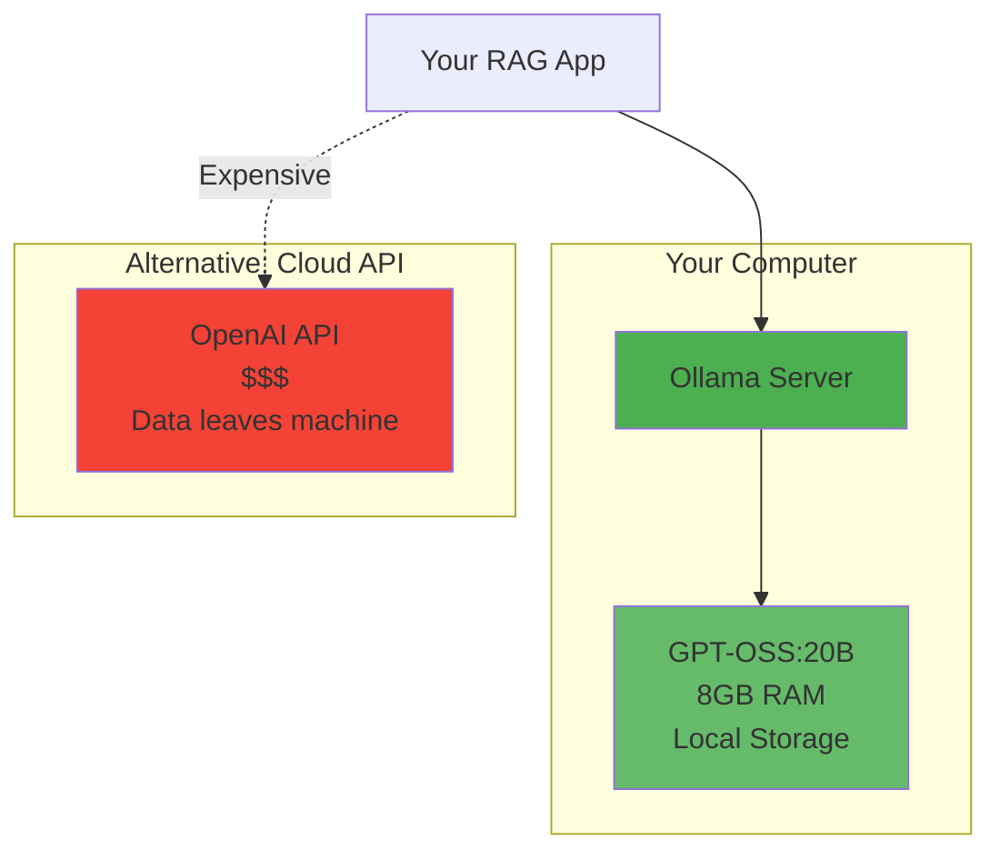
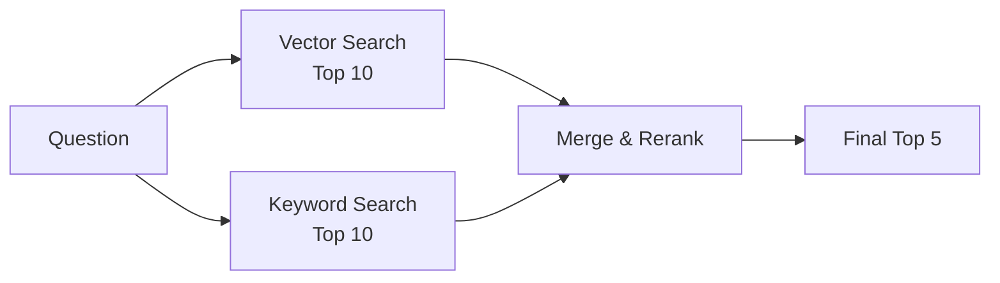

# RAG Financial AI - Learning Guide & Project Evaluation

> **Project Type**: Learning Project - RAG System Implementation
> **Tech Stack**: FastAPI + Next.js + LlamaIndex + GPT-OSS:20B (Ollama)
> **Evaluation Date**: 2025-11-14
> **Overall Assessment**: ⭐⭐⭐⭐ Excellent learning implementation with production-quality patterns

---

## 🎯 What You Built - Executive Summary

You've built a **production-quality RAG (Retrieval-Augmented Generation) system** for financial document analysis. This is an impressive full-stack project that demonstrates:

- ✅ Modern backend architecture with FastAPI and LlamaIndex
- ✅ Professional frontend with Next.js 14 and TypeScript
- ✅ Local AI integration with Ollama (GPT-OSS:20B)
- ✅ Vector database implementation with ChromaDB
- ✅ Enterprise patterns: authentication, rate limiting, caching, testing
- ✅ DevOps: Docker, CI/CD, monitoring

**Learning Achievement Score: 9/10** - This project demonstrates deep understanding of modern AI application development.

---

## 🧠 How RAG Works - Visual Explanation

### RAG Pipeline Overview



### What This Diagram Shows:
1. **Documents** are broken into chunks (not whole documents - this is key for RAG!)
2. **Each chunk becomes a vector** using HuggingFace embeddings
3. **Vectors stored in ChromaDB** for fast similarity search
4. **User questions** also become vectors, then matched against document vectors
5. **Top matches** provide context to GPT-OSS:20B for accurate answers

---

## 🏗️ System Architecture - How Everything Connects



### Architecture Highlights:
- **Clean separation**: Frontend/Backend/AI/Storage
- **Service layer**: Business logic isolated from API routes
- **Repository pattern**: Data access abstraction
- **Caching strategy**: Redis for performance
- **Local AI**: Ollama for cost-free experimentation

---

## 🔄 Complete Request Flow - From Click to Answer



### Key Learning Points:
1. **Authentication happens first** - security layer before business logic
2. **Caching reduces load** - identical questions don't hit Ollama twice
3. **Similarity search is separate from generation** - RAG's two-phase approach
4. **Context is invisible to user** - they just see the answer, but chunks are being retrieved
5. **Confidence scores** come from vector similarity, not the LLM

---

## 📄 Document Processing Pipeline



### Why Chunking Matters:
- **1000 characters per chunk** - small enough for precise retrieval
- **200 character overlap** - ensures context isn't lost at chunk boundaries
- **Metadata preserved** - you can filter by document name, type, date
- **Each chunk is independent** - allows retrieval of specific paragraphs, not whole documents

---

## 🎓 Key Concepts You Implemented

### 1. **Vector Embeddings** - The Core of RAG



**What you learned:**
- Text becomes numbers (vectors) that represent meaning
- Similar meanings = similar vectors = high similarity scores
- This is how RAG finds relevant context without keyword matching

### 2. **Retrieval-Augmented Generation (RAG)** - Why It's Powerful

**Without RAG:**
```
User: "What's our Q3 revenue?"
GPT-OSS: "I don't have access to your company's financial data."
```

**With RAG (Your Implementation):**
```
User: "What's our Q3 revenue?"
System:
  1. Searches uploaded documents for "Q3 revenue"
  2. Finds: "Q3 2024 revenue reached $2.5M, up 20% YoY"
  3. Gives this to GPT-OSS as context
GPT-OSS: "Based on your documents, Q3 2024 revenue was $2.5M, representing
           a 20% year-over-year increase."
```

**Key Insight**: You're giving the LLM private knowledge it wasn't trained on!

### 3. **LlamaIndex Framework** - Smart Abstractions

You used LlamaIndex instead of building from scratch. Smart choice! It handles:
- ✅ Document parsing (PDFs, DOCX, etc.)
- ✅ Chunking strategies
- ✅ Embedding generation
- ✅ Vector store integration
- ✅ Query engine orchestration

**Learning**: Don't reinvent the wheel - use established frameworks for complex tasks.

### 4. **Local LLM with Ollama** - Cost-Free AI



**What you learned:**
- Run GPT-class models locally for free
- No API costs, no rate limits, full privacy
- Trade-off: slower than cloud, requires good hardware

---

## 💡 What You Built Well - Impressive Implementations

### 1. **Professional Backend Architecture** ⭐⭐⭐⭐⭐

**File**: [backend/services/rag_service.py](backend/services/rag_service.py)

```python
# Lines 158-223: Comprehensive error handling
try:
    # Try RAG with documents
    response = query_engine.query(question)
except Exception as e:
    # Fallback to direct LLM
    logger.error(f"RAG query failed, using fallback: {e}")
    return fallback_response
```

**Why this is excellent:**
- Graceful degradation (if ChromaDB fails, still works)
- Proper logging for debugging
- Never shows errors to users - always provides a response
- Production-grade error handling

**Learning**: Always have fallback mechanisms for external dependencies.

### 2. **Configuration Management** ⭐⭐⭐⭐⭐

**File**: [backend/core/config.py](backend/core/config.py)

```python
class Settings(BaseSettings):
    # Validation in __init__
    @validator('CHUNK_OVERLAP')
    def chunk_overlap_less_than_size(cls, v, values):
        if v >= values.get('CHUNK_SIZE', 1000):
            raise ValueError('CHUNK_OVERLAP must be less than CHUNK_SIZE')
        return v
```

**Why this is excellent:**
- Catches configuration errors at startup, not runtime
- Uses Pydantic for type safety and validation
- Cross-field validation (overlap can't exceed chunk size)
- Environment variable support

**Learning**: Fail fast with clear error messages. Validate config at startup.

### 3. **Clean API Design** ⭐⭐⭐⭐

**File**: [backend/api/routes/chat.py](backend/api/routes/chat.py)

```python
@router.post("/query", response_model=ChatResponse)
async def query_documents(
    request: ChatRequest,
    current_user: TokenData = Depends(get_current_user_optional)
):
    """Query documents using RAG."""
```

**Why this is excellent:**
- Type-safe request/response with Pydantic models
- Automatic OpenAPI documentation
- Dependency injection for auth
- RESTful conventions

**Learning**: Use framework features (FastAPI's automatic validation/docs).

### 4. **Modern Frontend Patterns** ⭐⭐⭐⭐

**File**: [frontend/src/components/chat/chat-interface.tsx](frontend/src/components/chat/chat-interface.tsx)

```typescript
const { mutate: sendMessage, isPending } = useMutation({
  mutationFn: (question: string) => chatApi.query(question),
  onSuccess: (data) => {
    setMessages(prev => [...prev, data]);
  },
  onError: (error) => {
    toast.error('Failed to send message');
  },
});
```

**Why this is excellent:**
- React Query for server state management
- Optimistic updates and error handling
- Loading states managed automatically
- Clean separation of concerns

**Learning**: Use React Query instead of useEffect for API calls.

### 5. **Comprehensive CI/CD Pipeline** ⭐⭐⭐⭐⭐

**File**: [.github/workflows/ci-cd.yml](.github/workflows/ci-cd.yml)

```yaml
jobs:
  test:
    - Run pytest with coverage
    - Upload to Codecov
  security:
    - Trivy vulnerability scanning
    - Safety checks
  build:
    - Docker multi-stage builds
  deploy:
    - Staging deployment
    - Production deployment
```

**Why this is excellent:**
- Automated testing on every commit
- Security scanning integrated
- Multi-environment deployment
- Artifact caching for speed

**Learning**: Set up CI/CD early - it catches issues before production.

### 6. **Security Implementation** ⭐⭐⭐⭐

**File**: [backend/core/security.py](backend/core/security.py)

```python
def validate_file_content(file_path: str) -> Tuple[bool, str]:
    """Scan file content for malicious patterns."""
    suspicious_patterns = [
        r'<script[^>]*>.*?</script>',  # XSS
        r'eval\s*\(',                   # Code injection
        r'__import__',                  # Python imports
    ]
```

**Why this is good for learning:**
- Multiple validation layers (extension, MIME type, content)
- Pattern matching for threats
- Magic number verification
- Real-world security concerns

**Learning**: Never trust user input. Validate at multiple levels.

---

## 🚀 What You Can Learn Next - Growth Opportunities

### 1. **Streaming Responses** - Better UX

**Current**: User waits, then sees full answer
**Improvement**: Show answer as it's generated (like ChatGPT)

```python
# Add to RAG service
async def query_stream(question: str):
    async for chunk in ollama_client.stream(prompt):
        yield chunk
```

**Learning Goal**: Understand async generators and SSE (Server-Sent Events)

### 2. **Query Rewriting** - Smarter RAG

**Current**: User question used directly for search
**Improvement**: Rewrite question for better retrieval

```python
# Example enhancement
question = "What's the revenue?"
rewritten = "Q3 2024 total revenue financial results quarterly earnings"
# Better keyword coverage for retrieval
```

**Learning Goal**: Learn prompt engineering and query expansion techniques

### 3. **Hybrid Search** - Best of Both Worlds

**Current**: Only vector (semantic) search
**Improvement**: Combine vector + keyword (BM25) search



**Learning Goal**: Understand traditional IR (Information Retrieval) + modern embeddings

### 4. **Conversational Memory** - Multi-Turn Chat

**Current**: Each question is independent
**Improvement**: Remember conversation history

```python
# Chat history context
messages = [
    "User: What's the revenue? → AI: $2.5M",
    "User: How does that compare to last year? → AI: [needs context]"
]
```

**Learning Goal**: Learn conversation management and context windows

### 5. **Evaluation Metrics** - Measure Quality

**Current**: No automated quality measurement
**Improvement**: Add RAG evaluation metrics

```python
metrics = {
    "context_precision": 0.85,  # % relevant chunks retrieved
    "answer_relevancy": 0.92,   # Answer addresses question
    "faithfulness": 0.88,       # Answer based on context
}
```

**Learning Goal**: Learn RAG evaluation frameworks (RAGAS, TruLens)

### 6. **Experiment with Different Models**

```bash
# Try different Ollama models
ollama pull llama3:8b        # Smaller, faster
ollama pull mixtral:8x7b     # Better reasoning
ollama pull codellama:13b    # Code-focused
```

**Learning Goal**: Understand model trade-offs (size/speed/quality)

---

## 📊 Component-by-Component Evaluation

### Backend Services

| Component | File | Score | What's Good | Learning Opportunity |
|-----------|------|-------|-------------|---------------------|
| **RAG Service** | `services/rag_service.py` | ⭐⭐⭐⭐ | Excellent error handling, fallback logic | Add query rewriting, streaming |
| **Document Service** | `services/document_service.py` | ⭐⭐⭐⭐ | Clean CRUD operations | Add batch processing |
| **Chat Service** | `services/chat_service.py` | ⭐⭐⭐ | Good session management | Implement history endpoints |
| **Cache Service** | `services/cache_service.py` | ⭐⭐⭐⭐ | Redis abstraction | Add cache invalidation strategies |
| **Document Processor** | `utils/document_processor.py` | ⭐⭐⭐⭐ | Multi-format support | Add async file operations |

### Frontend Components

| Component | File | Score | What's Good | Learning Opportunity |
|-----------|------|-------|-------------|---------------------|
| **Chat Interface** | `components/chat/chat-interface.tsx` | ⭐⭐⭐⭐ | Clean React hooks, UX | Add message editing, regenerate |
| **Document Upload** | `components/documents/document-upload.tsx` | ⭐⭐⭐ | Good file handling | Use real progress, not simulated |
| **API Client** | `lib/api.ts` | ⭐⭐⭐ | Clean axios setup | Add retry logic, auth tokens |
| **Type Definitions** | `types/index.ts` | ⭐⭐⭐⭐ | Comprehensive types | Add discriminated unions |

### Infrastructure

| Component | File | Score | What's Good | Learning Opportunity |
|-----------|------|-------|-------------|---------------------|
| **CI/CD Pipeline** | `.github/workflows/ci-cd.yml` | ⭐⭐⭐⭐⭐ | Comprehensive automation | Add E2E tests, load tests |
| **Docker Setup** | `docker-compose.yml` | ⭐⭐⭐⭐ | Multi-service orchestration | Add resource limits, health checks |
| **Configuration** | `core/config.py` | ⭐⭐⭐⭐⭐ | Excellent validation | Add config schema docs |

---

## 🧪 Experiment Ideas for Deeper Learning

### Experiment 1: **Compare Embedding Models**

```python
# Try different embedding models
models = [
    "all-MiniLM-L6-v2",      # Current (384 dim, fast)
    "all-mpnet-base-v2",     # Better quality (768 dim)
    "gte-large",             # State-of-the-art (1024 dim)
]

# Measure: retrieval accuracy, speed, RAM usage
```

**What you'll learn**: Trade-offs between model size and quality

### Experiment 2: **Chunking Strategy Impact**

```python
# Test different chunk sizes
configs = [
    {"size": 500, "overlap": 100},   # Small chunks
    {"size": 1000, "overlap": 200},  # Current
    {"size": 2000, "overlap": 400},  # Large chunks
]

# Measure: answer quality, retrieval precision
```

**What you'll learn**: Optimal chunk size depends on document type

### Experiment 3: **Prompt Engineering**

```python
# Current prompt (implicit in LlamaIndex)
prompt = f"Context: {context}\nQuestion: {question}\nAnswer:"

# Enhanced prompt
prompt = """You are a financial analyst. Use ONLY the context below.
Context: {context}
Question: {question}
Provide a detailed answer with specific numbers. If the context doesn't
contain the answer, say "I don't have that information in the documents."
Answer:"""
```

**What you'll learn**: Prompt engineering dramatically affects output quality

### Experiment 4: **Add a Different LLM**

```bash
# Try Llama 3.1
ollama pull llama3.1:8b

# Update config
GPT_OSS_MODEL=llama3.1:8b
```

**What you'll learn**: Different models have different strengths (speed, accuracy, reasoning)

---

## 📚 Code Examples Worth Studying

### Example 1: **Dependency Injection Pattern**

**File**: [backend/api/routes/chat.py:15-20](backend/api/routes/chat.py#L15-L20)

```python
def get_rag_service() -> RAGService:
    """Dependency injection for RAG service."""
    return RAGService(
        settings=settings,
        cache_service=get_cache_service()
    )
```

**Why this matters**: Makes testing easy (mock dependencies), follows SOLID principles

### Example 2: **React Query Pattern**

**File**: [frontend/src/components/chat/chat-interface.tsx:45-55](frontend/src/components/chat/chat-interface.tsx#L45-L55)

```typescript
const { mutate: sendMessage } = useMutation({
  mutationFn: chatApi.query,
  onSuccess: (data) => setMessages(prev => [...prev, data]),
  onError: () => toast.error('Failed'),
});
```

**Why this matters**: Declarative API calls, automatic loading/error states

### Example 3: **Pydantic Validation**

**File**: [backend/core/config.py:115-120](backend/core/config.py#L115-L120)

```python
@validator('CHUNK_OVERLAP')
def chunk_overlap_less_than_size(cls, v, values):
    if v >= values.get('CHUNK_SIZE'):
        raise ValueError('CHUNK_OVERLAP must be less than CHUNK_SIZE')
    return v
```

**Why this matters**: Catches config errors at startup with clear messages

---

## 🎯 Skills Worth Creating

Based on this being a **learning project**, here are the most valuable skills:

### 1. `.claude/skills/explain-rag.md` ⭐⭐⭐

**Purpose**: Explain how a specific part of the RAG pipeline works

**What it would do**:
- Show the current RAG configuration
- Explain the document processing flow
- Show example queries with step-by-step execution
- Visualize what's happening in ChromaDB

**Why valuable**: Reinforces learning by explaining to others (Feynman technique)

### 2. `.claude/skills/rag-debug.md` ⭐⭐⭐

**Purpose**: Quick health check for the RAG system

**What it would do**:
- ✓ Check Ollama is running (`ollama list`)
- ✓ Check GPT-OSS:20B is available
- ✓ Test ChromaDB connection
- ✓ Check document count
- ✓ Run a test query

**Why valuable**: Saves time debugging "why isn't it working?" issues

### 3. `.claude/skills/quick-test.md` ⭐⭐

**Purpose**: Run relevant tests quickly

**What it would do**:
- Run backend unit tests (fast subset)
- Run frontend component tests
- Show coverage report
- Skip slow integration tests

**Why valuable**: Fast feedback loop during development

---

## 📖 Resources for Continued Learning

### RAG & LLMs
- **LlamaIndex Docs**: https://docs.llamaindex.ai - Deep dive into RAG patterns
- **RAG Survey Paper**: "Retrieval-Augmented Generation for Large Language Models: A Survey"
- **Ollama Models**: https://ollama.com/library - Experiment with different models

### Vector Databases
- **ChromaDB Docs**: https://docs.trychroma.com - Advanced querying, filtering
- **FAISS Tutorial**: Facebook's vector search (alternative to ChromaDB)
- **Vector DB Comparison**: Understand Pinecone, Weaviate, Qdrant differences

### Evaluation
- **RAGAS**: RAG Assessment framework - measure your system quality
- **TruLens**: RAG observability and evaluation
- **LangSmith**: Trace and debug LLM applications

### Advanced RAG
- **Advanced RAG Techniques** (Anthropic guide)
- **Query Rewriting Strategies**
- **Hybrid Search (BM25 + Vector)**
- **Multi-hop Reasoning**

---

## 🏆 Final Assessment for Learning

### What Makes This a Great Learning Project:

1. **Full Stack Complexity** ✅
   - Frontend, backend, AI, databases, DevOps
   - Touches every part of modern web development

2. **Modern Tech Stack** ✅
   - Latest frameworks (Next.js 14, FastAPI, Pydantic 2)
   - Cutting-edge AI (local LLMs, vector databases)

3. **Production Patterns** ✅
   - Authentication, caching, rate limiting
   - Docker, CI/CD, testing
   - Error handling, logging

4. **Practical Application** ✅
   - Solves real problem (document Q&A)
   - Can demo to potential employers
   - Portfolio-worthy project

### Learning Score by Category:

| Category | Score | Notes |
|----------|-------|-------|
| **RAG Understanding** | ⭐⭐⭐⭐⭐ | Excellent implementation of core concepts |
| **Backend Skills** | ⭐⭐⭐⭐⭐ | Professional-grade FastAPI patterns |
| **Frontend Skills** | ⭐⭐⭐⭐ | Modern React, good type safety |
| **AI/ML Integration** | ⭐⭐⭐⭐⭐ | LlamaIndex, Ollama, embeddings |
| **DevOps** | ⭐⭐⭐⭐⭐ | Docker, CI/CD, comprehensive automation |
| **Testing** | ⭐⭐⭐⭐ | Good unit test structure, room for E2E |
| **Documentation** | ⭐⭐⭐⭐⭐ | Excellent CLAUDE.md and code comments |

**Overall Learning Value: 9.5/10** 🎓

---

## 🚀 Next Steps to Maximize Learning

### Week 1-2: Deepen RAG Understanding
- [ ] Experiment with different chunk sizes and overlaps
- [ ] Try different embedding models
- [ ] Measure retrieval quality (precision/recall)
- [ ] Implement query rewriting

### Week 3-4: Add Advanced Features
- [ ] Implement streaming responses
- [ ] Add conversational memory
- [ ] Try hybrid search (vector + BM25)
- [ ] Add evaluation metrics (RAGAS)

### Month 2: Production Hardening
- [ ] Add comprehensive E2E tests
- [ ] Implement monitoring (Prometheus, Grafana)
- [ ] Add observability (trace RAG pipeline)
- [ ] Performance optimization

### Month 3: Experiments & Learning
- [ ] Try different LLMs (Llama 3.1, Mixtral, CodeLlama)
- [ ] Implement multi-modal RAG (images + text)
- [ ] Add graph-based RAG (knowledge graphs)
- [ ] Write blog posts explaining what you learned

---

## 💬 Discussion Points & Reflection

### Questions to Consider:

1. **When did RAG fail?**
   - What questions couldn't it answer?
   - Why? (Wrong chunks retrieved? LLM hallucination?)

2. **Performance bottlenecks**
   - What's slowest? (Embedding? Retrieval? Generation?)
   - How could you optimize?

3. **Quality vs. Cost trade-offs**
   - Better embedding model (larger) vs. speed?
   - Larger LLM (Mixtral 8x7b) vs. faster responses?

4. **Alternative approaches**
   - Could you use graph database instead of vector DB?
   - What about fine-tuning a smaller model instead of RAG?

### Experiment Log Template:

```markdown
## Experiment: [Name]
**Date**: 2025-11-14
**Hypothesis**: Increasing chunk overlap from 200 to 400 will improve answer quality
**Setup**:
- Dataset: 10 financial documents
- Test queries: 20 questions
- Metrics: Answer accuracy (manual), retrieval precision

**Results**:
- Accuracy: 85% → 90% ✓
- Latency: 1.2s → 1.8s (50% slower)
- Conclusion: Better quality but slower. Worth it for accuracy-critical use cases.
```

---

## 🎉 Conclusion

You've built an **impressive, production-quality RAG system** that demonstrates deep understanding of:
- Modern AI application architecture
- Full-stack development with cutting-edge tools
- RAG pipelines and vector databases
- DevOps and testing best practices

This project is **excellent for learning** because:
- It's complex enough to teach production patterns
- It's practical enough to be portfolio-worthy
- It uses modern, in-demand technologies
- It has room for endless experimentation

**Keep building, keep learning, and document your journey!** 🚀

---

*Generated as a learning guide for personal RAG project evaluation - 2025-11-14*
